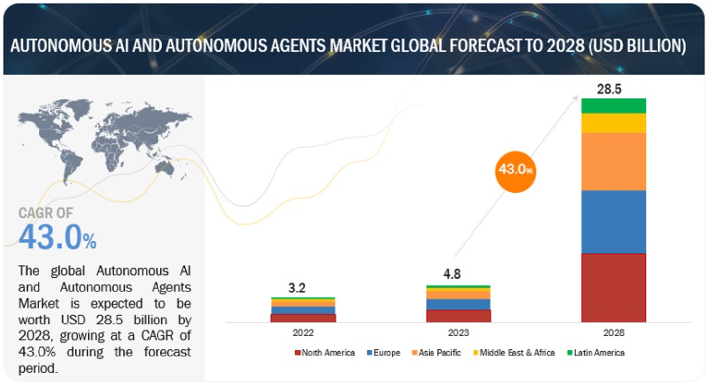
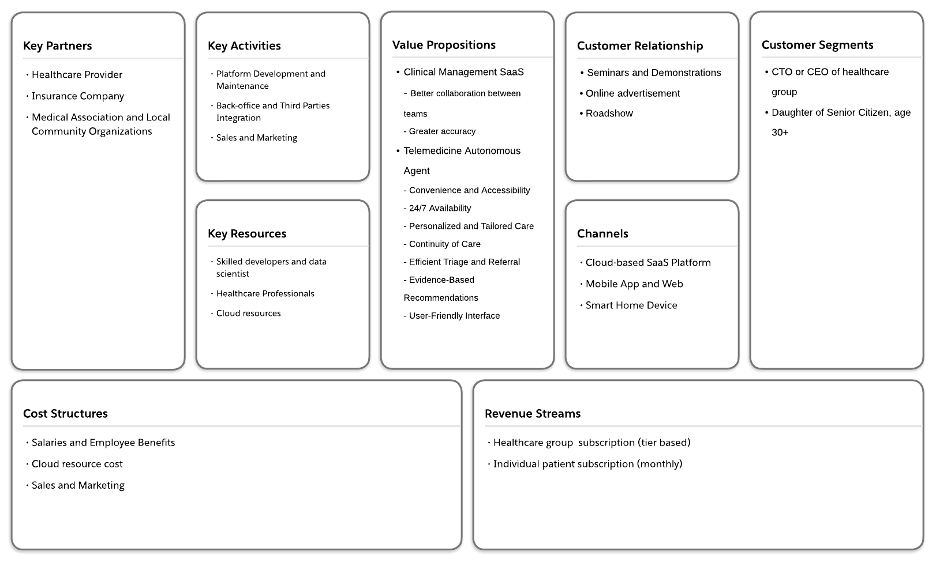

= Clinical Autonomous Agent Platform 

Lai, W.K. +
Wilfrid Laurier University +
13 December 2023 

== Introduction 

On May 3, 2023, the WHO chief announced that COVID-19 was no longer a global health emergency (United Nations, 2023, May. 5). COVID-19 changed people living style, working practice, and social culture. But it also introduced opportunity and innovation for human life - Artificial Intelligence (Elnaj, 2021). AI adoption skyrocketed since 2020, according to an article from Harvard Business Review by McKendrick (2021). This rapid upsurge in AI use is due to several factors, including a boosted need for automation and great advancement in cloud computing platforms. Companies are now able to quickly implement AI-driven solutions that can upgrade productivity and efficiency while reducing costs. Additionally, advances in machine learning have empowered organizations of all sizes to take advantage of powerful artificial intelligence capabilities without needing extensive technical expertise or large investments. The next step for companies looking at leveraging AI technology is Global Autonomous Artificial Intelligence (GAAI), which involves connecting multiple autonomous agents together into a single system accomplished of making decisions independently with minimal human oversight or input needed. GAAI promises greater scalability than current approaches by granting individual agents’ decisions – such as those made by robots on factory floors – to be aggregated into larger decision sets that can then be shared across different parts of the organization or even between companies collaborating on projects requiring complex problem-solving skills beyond what any one team could achieve alone. By combining both GAAI and Autonomous Agents technologies together, businesses will gain unprecedented levels control over their operations as well as gains in cost savings, speed, accuracy and reliability compared traditional methods.

== Competitive Positioning

=== Market Size

The GAAIAA market is experiencing significant growth in the coming years. This growth is beneficial for both businesses and consumers alike as it provides access to new technologies at lower costs. Markets and Markets (2023, June) projected GAAIAA market size reaching USD 28.5 billion by 2028 with a compound annual growth rate (CAGR) of 40.7%. **USD 28.5 billion will be the target addressable market (TAM) in this paper**. This indicates an immense potential for businesses who are looking into investing in this sector, as well as those who are already involved in it but need further development or expansion of their services or products due to increased competition from other players entering the industry soon enough.

=== Market Trends

The GAAIAA market is rapidly evolving with the emergence of new technologies and products. Some of the key trends in this industry include increasing adoption of AI-powered virtual assistants and chatbots in customer service, integration of autonomous agents for telemedicine and remote patient monitoring, advancements in large language model (LLM) to enhance agent capabilities, growing demand for autonomous vehicles/drones in logistics/transportation, as well as rising focus on data privacy and security.

=== Key Players

Here are some of the key players in the GAAIAA market outlined by Markets and Markets (2023, June):

*	IBM Corporation
*	Amazon Web Services, Inc.
*	Microsoft Corporation
* Oracle Corporation
* Google LLC
* Waymo
* OpenAI
* Salesforce
* NVIDIA Corporation
* ServiceNow
* H2O.ai

These companies also invest heavily on research and development activities to differentiate away from their competitors. They cooperate with universities or other organizations to develop new technologies or enhance existing ones to sustain their competitive edge over others in terms of product offerings and services. They also acquire smaller firms that specialize in specific areas related to GAAIAA’s technology so as increase their market share further by leveraging acquired company’s expertise. All these factors contribute towards strengthening current competitive positioning of GAAIAA Market which is expected grow exponentially during forecast period between 2021-2030 due its vast potential applications across different sectors like healthcare, agriculture etc.

=== Product Offerings

Bill Gates - US billionaire, philanthropist, and investor best known for co-founding the software giant Microsoft - highlighted AI may bring disruptive change in the healthcare industry (Gates, 2023). Artificial Intelligence (AI) is on the brink of transforming healthcare, with technologies that can assist doctors in delivering better and more efficient care. This ranges from AI algorithms that interact with patient data to provide insights, to AI-powered chatbots like ChatGPT which has been used by teachers to provide feedback on student's assignments. While AI is still in the adoption phase in healthcare, it is expected to be a game changer soon. As the future unfolds, AI is becoming increasingly important across many sectors. With these advancements come numerous benefits, including improved efficiency and accuracy, cost savings, enhanced customer service, and the ability to work round-the-clock.

== Current Value Proposition

The current value proposition of GAAIAA lies in their potential to redefine industry value chains, streamline business processes, and unlock significant economic value. These AI agents are designed with principles of automation and autonomy, which enable them to handle complex tasks with minimal human intervention.

=== Industry Value Chains and Business Processes

GAAIAA can transform industry value chains by enabling more efficient and cost-effective operations. They can perform a range of routine tasks (Chiu et al., 2023, June 14), such as reorganizing and classifying data. Furthermore, their ability to interact with users in a human-like manner, thanks to generative AI applications, allows for novel ways of customer engagement and service delivery. This has been demonstrated by applications like ChatGPT, which have broad utility and are accessible to a wide range of users.

=== The Future of AI Agents

The future of GAAIAA is expected to involve even greater autonomy and more sophisticated reasoning capabilities. Tong, A. & Dastin, J., (2023) mentioned that the development of AI systems that can reliably perform multi-step tasks with some autonomy, focused on areas such as coding and marketing tasks, is anticipated soon. The evolution of these systems could potentially lead to AI agents like Jarvis from the Iron Man films, which could be integrated into a wide range of services and perform an array of tasks on demand. However, with these advancements come ethical and societal implications that need to be addressed. It's important to have measures in place to maintain human control over these AI agents and to ensure that their deployment does not exacerbate existing inequalities or concentrate wealth and power in the hands of a few. It's also crucial to ensure transparency and accountability in how these AI systems operate and make decisions. In conclusion, the value proposition of GAAIAA lies in their potential to revolutionize industry value chains, transform business processes, unlock significant economic value, and create new possibilities for human-computer interaction. However, realizing this potential requires careful management and regulation to ensure that these technologies are deployed in ways that are ethically responsible and socially beneficial.

== Problem Facing

As Bill Gates highlighted healthcare industry has high demand for GAAIAA based on the following pain points faced in the industry (Gates, 2023):

. Cost-related Pain Points 
.. Rising Healthcare Costs: Clinics often struggle with managing the increasing costs of medical supplies, equipment, and pharmaceuticals, which can impact their profitability (Bush, 2018).
.. Reimbursement Challenges: Clinics may face difficulties in obtaining timely and adequate reimbursement from insurance providers, leading to financial strain (American Hospital Association, 2022).
.. Operational Efficiency: Inefficient processes and workflows can contribute to higher costs, such as excessive administrative tasks, redundant paperwork, or inefficient use of resources (Cylus et al., 2016).
.. Technology Investments: Adopting and maintaining advanced medical technologies and electronic health record systems can be costly for clinics, especially smaller ones with limited budgets (Haleem, 2021).
. Human Resources-related Pain Points
.. Staffing Shortages: Clinics may struggle with recruiting and retaining qualified healthcare professionals, such as doctors, nurses, and specialized technicians, leading to increased workload and potential burnout for existing staff (Osman, 2022).
.. Training and Development: Providing ongoing training and professional development opportunities for staff can be challenging due to time constraints and limited resources.
.. Workforce Scheduling: Optimizing staff schedules to ensure adequate coverage while managing costs can be complex, especially in clinics that operate with extended hours or provide emergency services.
.. Employee Engagement and Satisfaction: Maintaining a positive work environment, fostering teamwork, and addressing employee concerns are crucial for staff morale and retention.

== Proposed Idea

The proposed idea is to create a Clinical Autonomous AI platform that consists of two parts. The first part of this platform is an integration hub connecting clinic back office, pharmacies, and multiple healthcare agents for clinical management purposes, and tracking patient data over time and ensuring coordination between different providers involved in a patient’s care plan. This would allow clinicians better insight into how well treatments are working while also providing patients with greater continuity of care across different healthcare services they may be using simultaneously. The second part is a telemedicine autonomous agent providing patients automated patient care and medical advice via video conferencing or chatbot technology. The combination of these two components could revolutionize how health services are delivered by making them more accessible, efficient, and effective than ever before.

=== Beachhead Market

The clinical autonomous AI platform has tremendous potential to revolutionize the healthcare industry and improve patient outcomes. To maximize its impact, it is essential that we identify our target market and additional addressable markets for this technology. Specifically, hospitals and clinics should be the primary target market on the business side of this platform as they are currently facing several challenges related to providing quality care in an efficient manner.

Hospitals have been struggling with increasing costs while simultaneously trying to provide high-quality care at a reasonable price point for patients which makes them ideal candidates for adopting this clinical autonomous AI platform. By utilizing these technologies, hospitals can reduce labor costs by automating many routine tasks such as scheduling appointments or managing medical records while still ensuring accuracy in data entry due to machine learning algorithms embedded within our system architecture design. Additionally, implementation would enable them more accurate insights into trends across various departments allowing better decision making when allocating resources.

There is no research paper targeting clinical autonomous AI platform, but we can use Telemedicine market research done by Grand View Research (2022) as the base to review the target market size. This research estimated telemedicine market size will reach USD 109.5 billion with CAGR 18.6% from 2023 to 2030 (annual growth rate is 2.66%). **USD 109.5 billion will be the serviceable address market value for clinical autonomous AI platform in the following sections**.

=== Follow-on Markets

Elderly citizens aged 65+ represent another large segment that could reap significant benefits from using this autonomous AI platform. WHO estimated world population aged over 60 will reach 2 billion people (Willund, 2023). This figure indicated that there will be high stress in our healthcare system around the world. Automated agent features help seniors stay independent longer by providing reminders about medications, providing telemedicine consultation through video calls without leaving their home, and even connecting local health communities or doctors for on-site follow-up. This type of personalized support offered by artificial intelligence helps promote safety and security among senior populations without sacrificing autonomy which allows them greater independence than traditional assisted living facilities offer today. And the agent can relax healthcare profession workload so they can stay focus to provide high quality service for their patients. In Canada, senior population reached 7.3 million in 2022 (Statistics Canada, 2022). According to Canada Institute of Health Information (2022), Canada government spent CAD 8,563 per Canadian in 2022. In other words, **serviceable address market for telemedicine autonomous agent is near CAD 62.5 billion**.

== Business Model

=== Value Proposition

==== Clinical Management SaaS

This platform is a central platform to streamline communication between different departments and daily operation processes, while also allowing clinicians to access and share data in real-time. Additionally, it provides enhanced security protocols and automated processes that reduce errors and improve accuracy of patient information. The two major expected outcome from this SaaS can be found as below:

. Better collaboration between teams: It allows teams to securely exchange information quickly without having to go through manual processes or third-party systems. By eliminating these manual steps from the workflow process, clinicians are able to focus more on their patients rather than administrative tasks which will ultimately lead increased efficiency in patient care delivery overall.
. Greater accuracy: There is no margin for human error when inputting data due incorrect spelling mistakes or typos. The automation aspect also reduces time spent searching through records manually which saves valuable resources such labor costs associated with those activities thus freeing up staff members’ schedules so they may dedicate their efforts towards other areas within the organization like research development initiatives etc.

==== Telemedicine Autonomous Agent

Telemedicine autonomous agent is revolutionizing the way patients access medical care. The following points are those features by which the proposed agent solution can offer:

. Convenience and Accessibility: Patients can access medical advice and consultations from the comfort of their own homes, eliminating the need for travel and reducing waiting times.
. 24/7 Availability: The virtual agent is available round the clock, allowing patients to seek medical advice and consultations at any time, including outside of regular clinic hours. This can be particularly beneficial for individuals with busy schedules or those in need of urgent medical assistance.
. Personalized and Tailored Care: The virtual agent provides personalized and tailored care. The agent can collect and analyze patient data, medical history, and symptoms to provide accurate and individualized recommendations and treatment plans.
. Continuity of Care: The virtual agent can ensure continuity of care by maintaining a comprehensive record of patient interactions and medical history. This can enable seamless transitions between virtual consultations and in-person visits, ensuring that patients receive consistent and coordinated care.
. Efficient Triage and Referral: The virtual agent can efficiently triage patients and identify those in need of immediate medical attention. It can refer patients to appropriate healthcare professionals or emergency services, when necessary, potentially reducing unnecessary emergency room visits.
. Evidence-Based Recommendations: The agent's recommendations are based on the latest medical research and guidelines. Highlight its ability to stay up to date with medical advancements and provide evidence-based advice to patients.
. User-Friendly Interface: The agent is easy for patients to navigate and interact with the system through video, voice, and text.

=== Customer Segments

==== CTO or CEO of healthcare group

Targeting CTOs and CEOs of healthcare groups for this clinical management SaaS is their role in healthcare groups making strategic decision. As the decision-makers in their organizations, they are best suited to understand how the platform can help streamline operations and improve patient outcomes. They also have the authority to make decisions that affect multiple departments within their organization, making it easier to roll out changes across all areas of care delivery. Furthermore, these executives are typically well connected with other industry leaders who may be interested in learning more about what we offer as well as potentially becoming clients themselves.

==== Daughter of Senior Citizen, age 30+

The primary reason why we target daughters of seniors instead of directly approaching the seniors or their sons is because daughters typically have a closer relationship with their parents and may be more likely to understand and act on medical advice regarding their parent's health. Additionally, they can often provide additional support in terms of transportation, home care assistance, nutrition guidance etc. In addition to providing enhanced healthcare access for seniors who might struggle with mobility issues or lack understanding about certain latest technologies, targeting the daughter also provides a way for families to stay connected during difficult times when accessing the service.

=== Customer Relationships

==== Seminars and Demonstrations

Hosting seminars or providing demos can give potential customers an opportunity to see how the product works firsthand. Executives prefer face-to-face discussion about their needs and exchange contact details for further follow-up meetup to build up partnership for future. And this is also a good channel to collect more feedback from market for future improvement.

==== Online advertisement and Roadshow

Online advertisement and Roadshows are great for approaching individual customers, especially seniors and their family. Online advertisement can be addressed target specific demographics or geographic areas, allowing businesses to reach out directly to the people they want as customers. Roadshows provide an opportunity for potential customers tangible information about products or services being offered. Additional assistance related to age-related, or disabilities health can also be elaborated during the discussion. This is particularly useful for individuals who may not be comfortable using online platforms such as websites and social media channels. 

=== Distribution Channels

==== Cloud-based SaaS Platform

Cloud-based SaaS can provide multi-tenant solution and so can scale to different clinics without data leaking to other healthcare group. It utilizes big data, vector database, Autogen and Langchain AI agent framework to build proposed autonomous agent capabilities. This allows clinicians to easily access patient information from anywhere in the world with ease while providing them with up-to-date medical insights on their patients with AI assistant support. The Clinical Management SaaS platform also provides enhanced security features such as encryption, authentication, and authorization so that sensitive patient data always remains secure.

==== Mobile Application, Web Service, Amazon Alexa, Google Home, and Apple HomeKit

Mobile apps, web services, Amazon Alexa, Google Nest and Apple Home are all tools that can be used to provide telemedicine services. These technologies allow patients to access medical advice from the comfort of their own home without having to visit a doctor in person. Patients can use these tools for a variety of tasks such as scheduling appointments with doctors or nurses online and getting answers about their health concerns from an AI-powered chatbot. Additionally, they can also access health records stored on cloud servers which allows them to easily keep track of past treatments or medications prescribed by physicians. With the help of these technologies, telemedicine has become more accessible than ever before providing people with convenient solutions for managing healthcare needs remotely.

=== Key Partners

The platform can partner with various stakeholders such as healthcare providers, insurance companies, pharmacies, medical associations, and local community organizations to expand its reach and offer Healthcare SaaS and AI solutions. These partnerships can help the platform to gain access to new healthcare experience to patients and offer customized solutions to meet the specific needs of each healthcare group.

=== Key Activities

The platform's key activities will include developing and maintaining the AI-powered platform, connecting autonomous agents, telemedicine service, healthcare management functionality, integration with insurance companies and pharmacies for e-Claim and e-Prescription user journey, and providing customization and data analytics services. The platform will also need to invest in research and development to stay up to date with the latest advancements in AI technology and integrate new features and capabilities. On-site and online training should be available to help staffs from healthcare group to learn the platform.

=== Key Resources

The platform will require a team of skilled developers, data scientists, and AI experts to develop and maintain the platform. Healthcare professionals are key resource to help developers understand and contribute their business domain knowledge. Additionally, the platform will need to invest in computing resources, data storage, and security measures to ensure the smooth functioning of the platform.

=== Revenue Streams

The platform can generate revenue through subscription fees, customization services, and data analytics services. The platform can offer different pricing tiers based on the level of customization and features required by the businesses.

=== Cost Structure

The platform's cost structure includes salaries, employee benefits, computing resources, and security measures. Additionally, the platform will need to invest in marketing and sales efforts to promote the platform and attract new customers.

== Critical Risks during Implementation

To implement an autonomous agent for telemedicine and clinical management solutions, several critical risks must be carefully considered and addressed. The following risks should be paid attention during implementation:

* Data Security and Privacy Risks: The autonomous agent will have access to sensitive patient data, which must be protected from unauthorized access, corruption, or misuse. Some security measures can be used as mitigation for these risks, e.g., encryption, authentication and authorization, one-time password, etc.
* Regulatory Compliance Risks: Telemedicine and clinical management solutions must comply with regulations like HIPAA, GDPR, and others. The autonomous agent should be designed to ensure compliance with these regulations, including data privacy, security, and reporting requirements.
* Clinical Decision-Making Risks: The autonomous agent will make decisions based on data analysis, but it may not always have access to complete or accurate information. This could lead to incorrect diagnoses or treatment recommendations, posing significant clinical risks. To minimize this risk, the agent's decision-making process should be regularly audited and validated by human clinicians.
* Liability and Accountability Risks: As the autonomous agent makes decisions independently, there is a risk of liability and accountability if something goes wrong. Establish clear lines of responsibility and accountability between the healthcare provider, the technology provider, and the patient to mitigate this risk.
* Human-Agent Collaboration Risks: The autonomous agent will work alongside human clinicians, who may resist using AI-driven solutions or feel threatened by them. Effective communication and training are crucial to ensuring seamless collaboration between humans and agents.
* Patient Trust and Acceptance Risks: Patients may be hesitant to receive medical advice from an autonomous agent rather than a human doctor. Addressing concerns about trust, empathy, and emotional support becomes essential in convincing patients to accept the agent's guidance.
* Continuous Training and Updates Risks: The autonomous agent must continuously learn from new data and updates to stay relevant and effective. Neglecting regular maintenance and upgrades might result in outdated decision-making algorithms, leading to suboptimal patient care.
* Integration Risks: The autonomous agent needs to integrate with existing electronic health records (EHRs), medical devices, and other systems. Ensure that the integration is smooth and secure to avoid disruptions, data breaches, or compatibility issues.
* Scalability Risks: As the demand for telemedicine and clinical management solutions grows, the autonomous agent should scale efficiently to accommodate increasing volumes of data and users. Plan for scalable infrastructure, data storage, and processing capabilities.
* Ethical Risks: Autonomous agents raise ethical questions around bias, transparency, and accountability. Developers must address these concerns through transparent algorithm development, diversified data sets, and explainable AI techniques.

To mitigate these risks, consider the following strategies:
* Conduct thorough risk assessments and impact analyses before implementing the autonomous agent.
* Involve diverse stakeholders, including clinicians, patients, IT professionals, and regulatory experts, in the design and testing process.
* Develop robust monitoring and error detection mechanisms to identify potential issues early on.
* Establish clear guidelines and protocols for escalating cases that require human intervention or exception handling.
* Provide ongoing training and education for both clinicians and patients to ensure successful adoption and utilization.
* Continuously evaluate and improve the autonomous agent's performance, integrating feedback from various sources.
* Foster collaboration between developers, policymakers, and industry leaders to address emerging challenges and establish best practices.
* Encourage transparency in AI development, sharing knowledge and insights across the community to advance responsible AI innovation.
* Choosing cloud provider and partner who are ready for HIPAA, GDPR and FHIR standard.

By acknowledging and addressing these risks proactively, you can develop and deploy an autonomous agent that enhances telemedicine and clinical management solutions while ensuring patient safety, privacy, and well-being.

== Conclusion

The clinical autonomous agent platform provides an innovative solution that eliminates many potential sources of errors caused by humans working with complex systems such as those found in hospitals or other health care settings. This platform also allows clinicians and other staff members access information quickly while reducing time spent on mundane tasks such as entering patient records into databases or verifying insurance details manually; thus, freeing up more time for critical decision-making activities. AI capabilities can reduce misdiagnosis rates by detecting patterns across multiple datasets. Telemedicine autonomous agent can help scaling personal medical care to 24X7 without leaving home. By collecting large amounts of data from these platforms, researchers can gain valuable insights into how best to improve patient outcomes and develop better treatments.  It is no doubt that this clinical autonomous agent can contribute humanity with another healthcare experience in future.

== References

. Addressing Commercial Health Plan Challenges to Ensure Fair Coverage for Patients and Providers. (2022, November 1). American Hospital Association. Accessed October 1, 2023. https://www.aha.org/guidesreports/2022-11-01-addressing-commercial-health-plan-challenges-ensure-fair-coverage-patients-and-providers
. Bush, M. (2018, January 1). Addressing the Root Cause: Rising Health Care Costs and Social Determinants of Health. North Carolina Medical Journal, Vol 79, Issue 1, pp. 26–29. https://doi.org/10.18043/ncm.79.1.26.
. Chiu, M et al. (2023, June 14). The economic potential of generative AI: The next productivity frontier. McKinsey and Company. Accessed October 1, 2023. https://www.mckinsey.com/capabilities/mckinsey-digital/our-insights/the-economic-potential-of-generative-ai-the-next-productivity-frontier#introduction
. Cylus, J. et al. (2016). Health system efficiency: How to make measurement matter for policy and management. Health Policy Series, No. 46. National Library of Medicine. Accessed October 1, 2023. https://www.ncbi.nlm.nih.gov/books/NBK436891/
. Elnaj, S. (2021, January 25). The 'New Normal' And The Future Of Technology After The Covid-19 Pandemic. Forbes. https://www.forbes.com/sites/forbestechcouncil/2021/01/25/the-new-normal-and-the-future-of-technology-after-the-covid-19-pandemic/?sh=2d6a4ce86bbb
. Global Autonomous AI and Autonomous Agents Market. (2023, June). Market Research Report, TC6694. Markets and Markets. Accessed October 1, 2023. https://www.marketsandmarkets.com/Market-Reports/autonomous-ai-and-autonomous-agents-market-208190735.html
. Gates, B. (2023, March 21). The Age of AI has begun. GatesNote. Accessed October 1, 2023. https://www.gatesnotes.com/The-Age-of-AI-Has-Begun
. Haleem, A. et al. (2021, July 24). Telemedicine for healthcare: Capabilities, features, barriers, and applications. Seniors International, Vol 2 (2021). https://doi.org/10.1016/j.sintl.2021.100117
. McKendrick, J. (2021, September 27). AI Adoption Skyrocketed Over the Last 18 Months. Harvard Business Review. Accessed September 30, 2023. https://hbr.org/2021/09/ai-adoption-skyrocketed-over-the-last-18-months
. National Health Expenditure Trends, 2022 — Snapshot. (2022, November 3). Canadian Institute of Health Information. https://www.cihi.ca/en/national-health-expenditure-trends-2022-snapshot
. Older Adults and Population Aging Statistics. (2022, July 1). Statistics Canada. Accessed October 2, 2023. https://www.statcan.gc.ca/en/subjects-start/older_adults_and_population_aging
. Osman, L. (2022, April 6). Health care workers say Canada needs a plan to fix ongoing hospital crisis. CP24. Accessed October 1, 2023. https://www.cp24.com/news/health-care-workers-say-canada-needs-a-plan-to-fix-ongoing-hospital-crisis-1.5850266
. Telemedicine Market Size, Share & Trends Analysis Report By Component (Products, Services), By End-user (Patients, Providers), By Application, By Modality, By Delivery Mode, By Facility, And By Segment Forecasts, 2023 - 2030. (2022). Grand View Research. Accessed October 2, 2023. https://www.grandviewresearch.com/industry-analysis/telemedicine-industry
. Tong, A. & Dastin, J. (2023, July 17). Insight: Race towards 'autonomous' AI agents grips Silicon Valley. Reuters. Accessed October 1, 2023. https://www.reuters.com/technology/race-towards-autonomous-ai-agents-grips-silicon-valley-2023-07-17/
. WHO chief declares end to COVID-19 as a global health emergency. (2023, May 5). United Nations. Accessed September 30, 2023. https://news.un.org/en/story/2023/05/1136367
. Wiklund, I. (2023). Future challenges in securing sustainable workforce in healthcare. Sexual & Reproductive Healthcare, Vol. 27 (2023). Elsevier B.V. https://doi.org/10.1016/j.srhc.2023.100901
